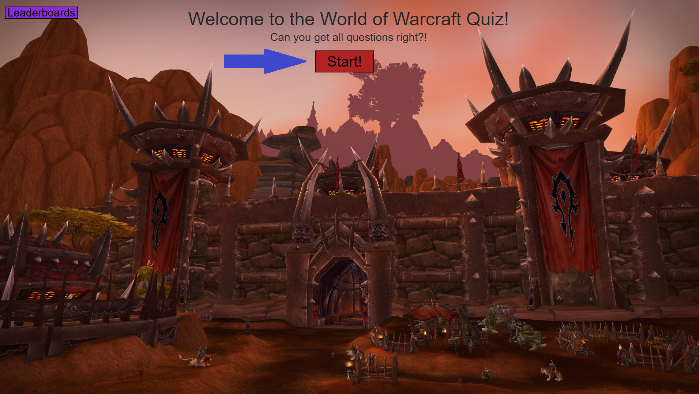
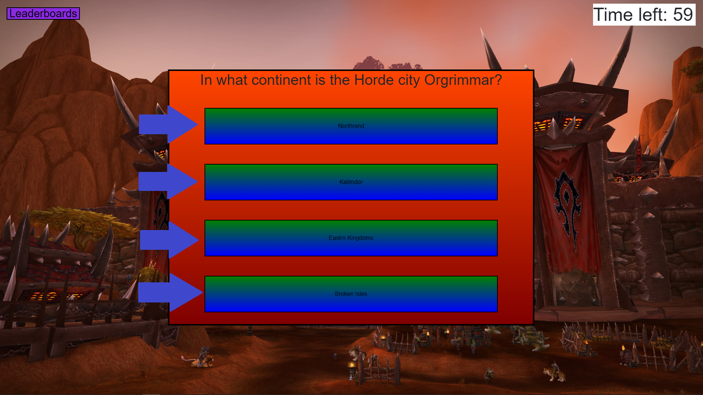

# World-of-Warcraft-Quiz

## Description

- I wanted to make a quiz for people who play World of Warcraft to test their knowledge of the game.
- I learned so many new things in this project. I had to figure out Interval timers, Changing styles, and localStorage all in JavaScript.

## Table of Contents 

Link to Deployed Page: https://www.google.com

- [Installation](#installation)
- [Usage](#usage)
- [Credits](#credits)
- [License](#license)

## Installation

To run the website, all you need to do is click the link in the 'Table of Contents' section above and it will take you directly to the page.

## Usage

To start the quiz, you need to press the red button that says 'Start'

    

    
Then it will ask you a question and give you 4 answers to the question you can choose.

## Credits

- https://stackoverflow.com/questions/7948333/css-position-text-in-the-middle-of-the-page
- https://stackoverflow.com/questions/31217268/center-div-on-the-middle-of-screen
- https://www.w3schools.com/howto/howto_css_center-vertical.asp

## License

MIT License

Copyright (c) [2022] [Justin Snyder]

Permission is hereby granted, free of charge, to any person obtaining a copy
of this software and associated documentation files (the "Software"), to deal
in the Software without restriction, including without limitation the rights
to use, copy, modify, merge, publish, distribute, sublicense, and/or sell
copies of the Software, and to permit persons to whom the Software is
furnished to do so, subject to the following conditions:

The above copyright notice and this permission notice shall be included in all
copies or substantial portions of the Software.

THE SOFTWARE IS PROVIDED "AS IS", WITHOUT WARRANTY OF ANY KIND, EXPRESS OR
IMPLIED, INCLUDING BUT NOT LIMITED TO THE WARRANTIES OF MERCHANTABILITY,
FITNESS FOR A PARTICULAR PURPOSE AND NONINFRINGEMENT. IN NO EVENT SHALL THE
AUTHORS OR COPYRIGHT HOLDERS BE LIABLE FOR ANY CLAIM, DAMAGES OR OTHER
LIABILITY, WHETHER IN AN ACTION OF CONTRACT, TORT OR OTHERWISE, ARISING FROM,
OUT OF OR IN CONNECTION WITH THE SOFTWARE OR THE USE OR OTHER DEALINGS IN THE
SOFTWARE.